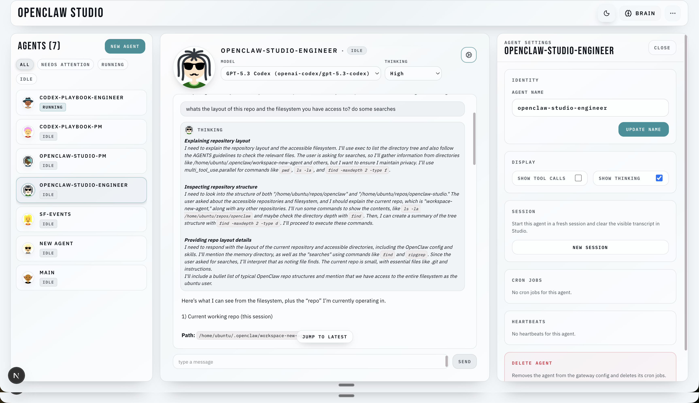

# OpenClaw Studio

[](https://discord.gg/YJVMZ9yf)

OpenClaw Studio 是 OpenClaw 的一个简洁 Web 仪表板。使用它来连接到您的网关（Gateway）、查看您的代理（agents）、聊天、管理审批并在一个地方配置作业（jobs）。

⭐ 请点个星标（Star）支持我们的成长！⭐

这有助于让更多开发者发现这个项目。

## 开始使用（选择您的设置）

如果您的网关已经在运行，请选择符合您的网关和 Studio 运行环境的场景：

- [A. 本地网关，本地 Studio（同一台电脑）](#a-本地网关本地-studio同一台电脑)
- [B. 云端网关，本地 Studio（您的笔记本电脑）](#b-云端网关本地-studio您的笔记本电脑)
- [C. 云端 Studio，云端网关](#c-云端-studio云端网关)

所有设置都使用相同的安装/运行路径（推荐）：`npx -y openclaw-studio@latest`

两个关键连接：

1. 浏览器 -> Studio
2. Studio -> 网关

`localhost` 始终指代“运行 Studio 的主机”。如果 Studio 和 OpenClaw 共享一台机器，即使该机器是云端虚拟机，上游（upstream）通常也应保持为 `ws://localhost:18789`。

## 要求

- Node.js 20.9+ (推荐使用 LTS 版本)
- OpenClaw 网关 URL + 令牌（token），或者 Studio 能检测到的本地 OpenClaw 安装
- Tailscale (可选，推荐用于远程访问)

## A) 本地网关，本地 Studio（同一台电脑）

```bash
npx -y openclaw-studio@latest
cd openclaw-studio
npm run dev
```

1. 打开 http://localhost:3000
2. 在 Studio 中设置：
   - 上游 URL (Upstream URL): `ws://localhost:18789`
   - 上游令牌 (Upstream Token): 您的网关认证凭据 (例如: `openclaw config get gateway.auth.password`)

## B) 云端网关，本地 Studio（您的笔记本电脑）

像上面一样在笔记本电脑上运行 Studio，然后设置一个笔记本电脑可以访问的上游 URL。

推荐做法（在网关主机上使用 Tailscale Serve）：

1. 在网关主机上：
   - `tailscale serve --yes --bg --https 443 http://127.0.0.1:18789`
2. 在 Studio（您的笔记本电脑上）：
   - 上游 URL: `wss://<gateway-host>.ts.net`
   - 上游令牌: 您的网关令牌
3. 注意：
   - 即使 OpenClaw 控制 UI 可以使用 Tailscale 身份标头，Studio 在此处仍需要网关令牌
   - 原始 `ws://<private-ip>:18789` 是一个高级/手动路径，可能需要额外的 OpenClaw 来源（origin）配置

备选方案（SSH 隧道）：

1. 在您的笔记本电脑上：
   - `ssh -L 18789:127.0.0.1:18789 user@<gateway-host>`
2. 在 Studio 中：
   - 上游 URL: `ws://localhost:18789`

## C) 云端 Studio，云端网关

这是“始终在线”的设置。当 Studio 和 OpenClaw 运行在同一个云端虚拟机上时，保持 OpenClaw 上游为本地，并单独解决浏览器访问 Studio 的问题。

1. 在将运行 Studio 的 VPS 上：
   - 运行 Studio（使用与上述相同的命令）。
2. 如果 OpenClaw 也在该 VPS 上，保持 Studio 的上游设置为：
   - 上游 URL: `ws://localhost:18789`
   - 上游令牌: 您的网关令牌
3. 通过 tailnet HTTPS 暴露 Studio：
   - `tailscale serve --yes --bg --https 443 http://127.0.0.1:3000`
4. 从您的笔记本电脑/手机打开 Studio：
   - `https://<studio-host>.ts.net`
5. 只有在 Studio 和 OpenClaw 位于不同机器上时，才使用远程上游，如 `wss://<gateway-host>.ts.net`。

注意：
- 除非您配置了 `basePath` 并重新构建，否则请避免在 `/studio` 路径下提供 Studio 服务。
- 如果 Studio 可以在回环地址（loopback）之外访问，则需要设置 `STUDIO_ACCESS_TOKEN`。
- 如果您将 Studio 绑定在回环地址之外，请从每个新浏览器打开一次 `/?access_token=...` 以设置 Studio cookie。

## 连接方式（心理模型）

OpenClaw Studio 现在运行一种具有**两条主要路径**的运行时架构：

1. 浏览器 -> Studio：HTTP + SSE (`/api/runtime/*`, `/api/intents/*`, `/api/runtime/stream`)
2. Studio -> 网关（上游）：由 Studio Node 进程打开的一条服务器拥有的 WebSocket 连接

这就是为什么 `ws://localhost:18789` 意味着“Studio 主机上的网关”，而不是“您手机上的网关”。

如果 Studio 通过 SSH 在远程机器上运行，且终端显示 `Open in browser: http://localhost:3000`，那么该 `localhost` 指的是远程机器。请使用 Tailscale Serve 或 SSH 隧道从您自己的笔记本电脑打开 Studio。

## 从源码安装（高级）

```bash
git clone https://github.com/grp06/openclaw-studio.git
cd openclaw-studio
npm install
npm run dev
```

源码检出中的可选设置辅助工具：

```bash
npm run studio:setup
```

这会在不先打开 UI 的情况下，为该 Studio 主机写入保存的网关 URL/令牌。

## 配置

路径和关键设置：
- OpenClaw 配置：`~/.openclaw/openclaw.json` (或通过 `OPENCLAW_STATE_DIR`)
- Studio 设置：`~/.openclaw/openclaw-studio/settings.json`
- 控制平面运行时数据库：`~/.openclaw/openclaw-studio/runtime.db`
- 默认网关 URL：`ws://localhost:18789` (可通过 Studio 设置或 `NEXT_PUBLIC_GATEWAY_URL` 覆盖)
- 域名 API 模式：始终启用。Studio 运行在服务器拥有的控制平面架构上。
- `STUDIO_ACCESS_TOKEN`：当将 Studio 绑定到公共主机（`HOST=0.0.0.0`, `HOST=::` 或非回环主机名/IP）时需要；对于仅限回环的绑定（`127.0.0.1`, `::1`, `localhost`）是可选的。

启动保护行为：
- `npm run dev` 和 `npm run dev:turbo` 在服务器启动前运行 `verify:native-runtime:repair`。
- `npm run start` 在启动前运行 `verify:native-runtime:check`（仅检查；无依赖项更改）。

为什么现在存在 SQLite：
- Studio 服务器拥有的控制平面在 `runtime.db` 中存储持久的运行时投影 + 重放发件箱。
- 这使得运行时历史记录和 SSE 重放在页面刷新和进程重启时保持确定性。

## UI 指南

有关 UI 工作流（代理创建、定时任务、执行审批），请参阅 `docs/ui-guide.md`。

## PI + 聊天流

有关 Studio 如何通过域 SSE (`/api/runtime/stream`) 流式传输运行时事件、应用重放/历史记录以及渲染工具调用、思考轨迹和最终转录行的信息，请参阅 `docs/pi-chat-streaming.md`。

## 权限 + 沙箱

有关代理创建选择（工具策略、沙箱配置、执行审批）如何从 Studio 流向 OpenClaw 网关，以及上游 OpenClaw 如何在运行时强制执行这些选择（工作区、沙箱挂载、工具可用性和执行审批提示），请参阅 `docs/permissions-sandboxing.md`。

## 颜色系统

请参阅 `docs/color-system.md` 了解语义颜色契约、状态映射和保护栏，这些确保了整个 UI 中动作/状态/危险用法的一致性。

## 故障排除

如果 UI 加载但“连接（Connect）”失败，通常是 Studio->网关的问题：
- 在 UI 中确认上游 URL/令牌（存储在 Studio 主机的 `<state dir>/openclaw-studio/settings.json`）。
- 如果 Studio 在远程主机上，请记住 `ws://localhost:18789` 指的是“Studio 主机上的 OpenClaw”，而不是“您笔记本电脑上的 OpenClaw”。
- 如果 Studio 在远程主机上且您无法从笔记本电脑打开 `http://localhost:3000`，请使用 `tailscale serve --yes --bg --https 443 http://127.0.0.1:3000` 暴露 Studio，或使用 `ssh -L 3000:127.0.0.1:3000 user@host`。
- `EPROTO` / “版本号错误”：您对非 TLS 端点使用了 `wss://...`（请使用 `ws://...`，或将网关放在 HTTPS 后面）。
- `.ts.net` + `ws://`：请改用 `wss://`。
- 资源在 `/studio` 下 404：在 `/` 路径下提供 Studio 服务，或配置 `basePath` 并重新构建。
- 401 “需要 Studio 访问令牌”：启用了 `STUDIO_ACCESS_TOKEN`；打开 `/?access_token=...` 一次以设置 cookie。
- 有用的错误代码：`studio.gateway_url_missing`, `studio.gateway_token_missing`, `studio.upstream_error`, `studio.upstream_closed`。

如果启动失败并出现 `better_sqlite3.node` / `NODE_MODULE_VERSION` 不匹配：
- 运行 `npm run verify:native-runtime:repair`
- 在启动 Studio 前，确认 `node` 和 `npm` 指向相同的运行时：
  - `node -v && node -p "process.versions.modules"`
  - `which node && which npm`
  - 如果它们不同（例如 Homebrew `npm` + `nvm` `node`），请先在该终端中运行 `nvm use`。
- 如果仍然失败，请运行：
  - `npm rebuild better-sqlite3`
  - `npm install`

## 架构

有关模块和数据流的详细信息，请参阅 `ARCHITECTURE.md`。
